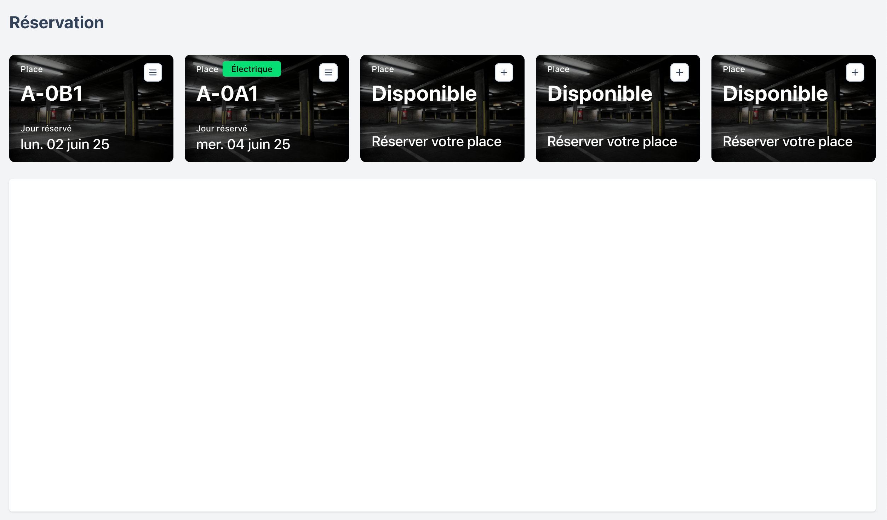
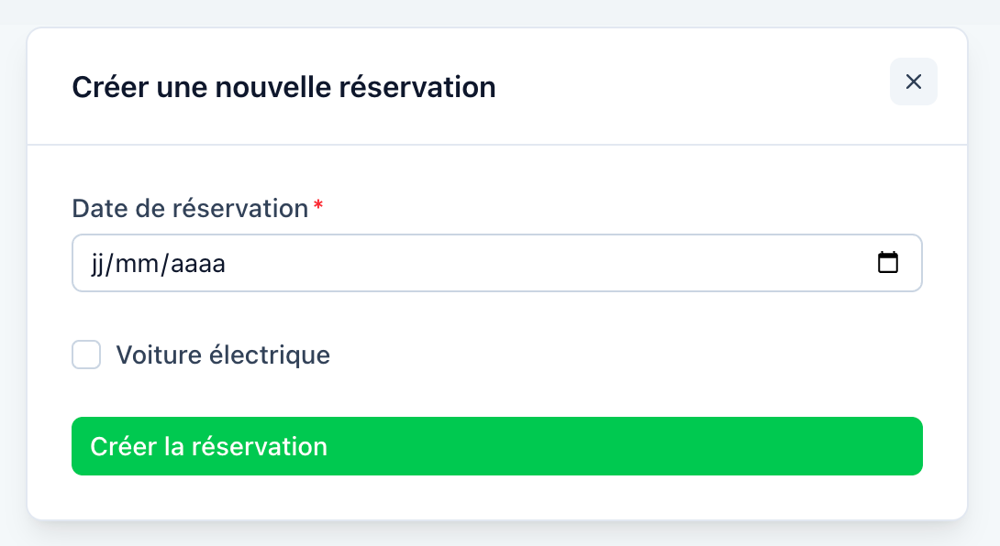
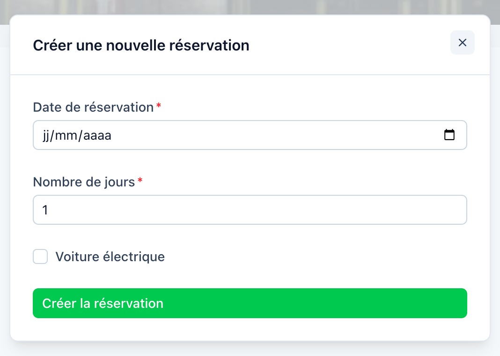
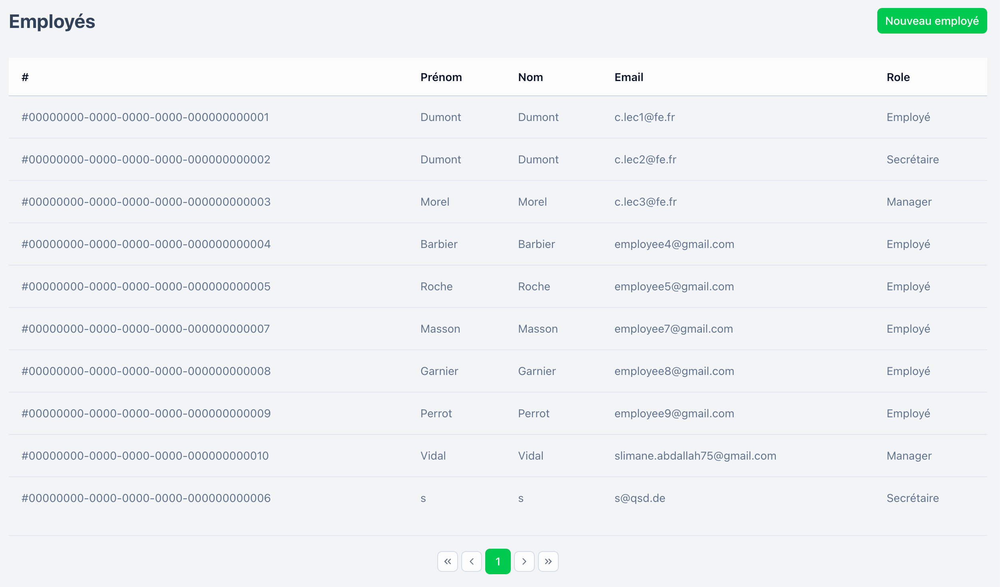
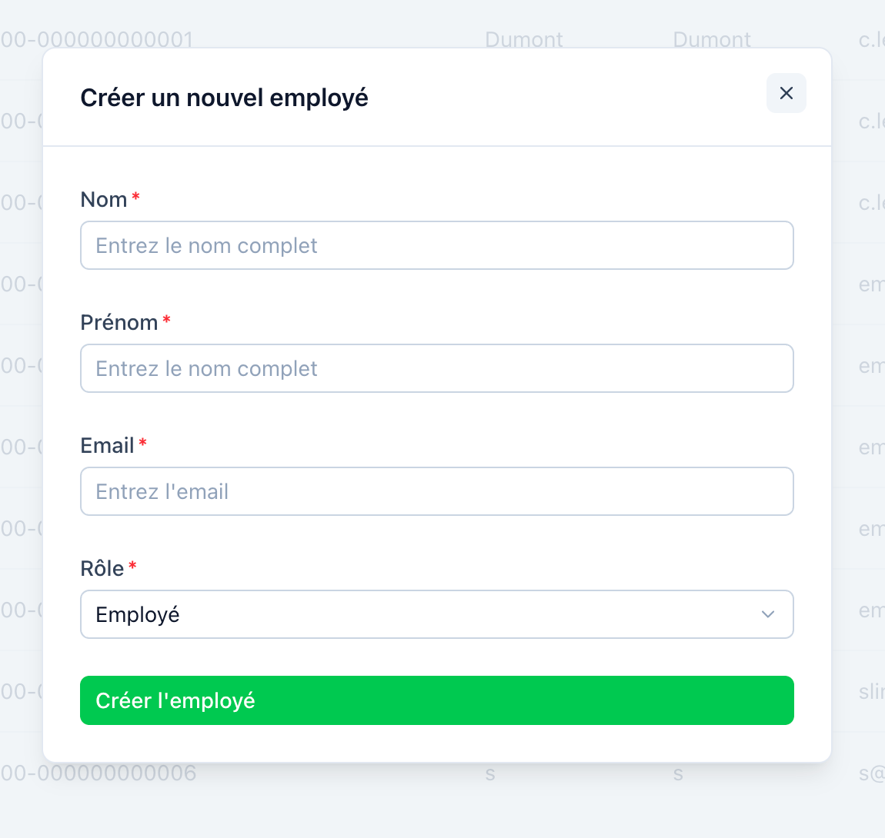

# 🧭 Introduction

Ce projet permet de gérer un système de réservation de places de parking pour une entreprise. Elle facilite la
réservation, la consultation et l'annulation de créneaux de stationnement, en prenant en compte les rôles des
utilisateurs (employé ou manager) le type de place (normale ou éléctrique), et la disponibilité.

🅿️ Présentation du produit :
Ce service permet à des employés ou managers de réserver des places de parking selon des règles métiers strictes (nombre
de jours autorisés, vérification de la disponibilité, type de place). Il intègre également un système de check in et
d'administration des utilisateurs (par la secrétaire)

👤 Public ciblé :

- Employés : peuvent réserver jusqu’à 5 jours ouvrés de stationnement.
- Managers : peuvent réserver 30 jours consécutifs de stationnement.
- Secrétaires : peuvent créer, modifier ou supprimer les comptes employés.

# Fonctionnalités principales

## Employé

- Réserver de manière autonome une place de parking tout en spécifiant le type de place (électrique ou non)
  
  

## Manager

- Réserver une place de parking pour le nombre de jours tout en spécifiant le type de place (électrique ou non)
  

## Secrétaire

- Accès à tous les employés qui peuvent accéder à l'application
  

- Ajouter un employé
  

- Modifier un employé
- Supprimer un employé

